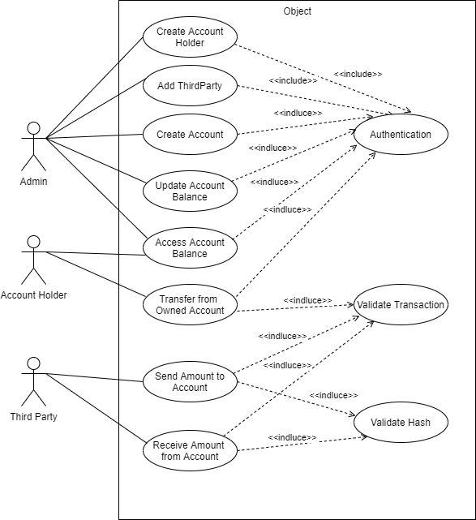
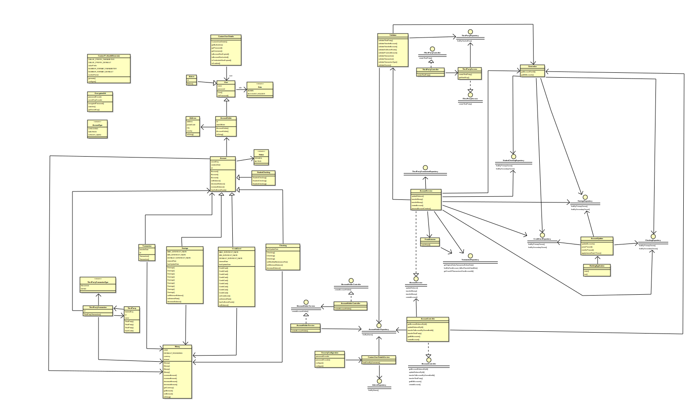

# MigNeves-Midterm_Project

## Table of Contents

1. [**Installation**](#Installation)
2. [**Users**](#Users)  
    1. [**Administrator (admin)**](#Administrator-admin)
    2. [**Account Holder**](#Account-holder)
    3. [**Third Party**](#Third-party)
3. [**Banking Accounts**](#Banking-accounts)
    1. [**Savings**](#Savings)
    2. [**Credit Card**](#Credit-card)
    3. [**Checking**](#Checking)
    4. [**Student Checking**](#Student-checking)
4. [**Walkthrough the Available Requests**](#Walkthrough-the-available-requests)
    1. [**Admin Allowed Requests**](#Admin-allowed-requests)
    2. [**Account Holder Allowed Requests**](#Account-holder-allowed-requests)
    3. [**Third Party Allowed Requests**](#Third-party-allowed-requests)
    4. [**Not Authenticated Requests**](#Not-authenticated-requests)
5. [**Diagrams**](#Diagrams)
    1. [**Use Case Diagram**](#Use-case-diagram)
    2. [**Class Diagram**](#Class-diagram) 

## Installation

Clone or download the project from this git repository.

**Setup** the recommended database through the following mySQL commands:
```
CREATE DATABASE IF NOT EXISTS banking;
CREATE DATABASE IF NOT EXISTS banking_test;

CREATE USER IF NOT EXISTS 'ironhacker'@'localhost' IDENTIFIED BY '1r0nh4ck3r';
GRANT ALL PRIVILEGES ON banking.* TO 'ironhacker'@'localhost';
GRANT ALL PRIVILEGES ON banking_test.* TO 'ironhacker'@'localhost';
FLUSH PRIVILEGES;
```

To run the application:
    - Open the repository as a project in a IDE;
    - Run the main application "BankingApplication.java", on the path:
      `./src/main/java/com/ironhack/midtermProject/BankingApplication.java`
    - Run the tests present in the tests' path:
      `./src/test/java`

It is also possible to change the properties in the application.properties file to a custom user and database. However, the tests
properties are defined in each test.

## Users

This banking application includes three types of Users: Administrator, Account Holder and Third Party.

### Administrator (Admin)

The Admin has the permission to:
- Create new banking accounts,
- Change the balance of existing accounts,
- Access banking accounts information,
- Add Third Party users.

### Account Holder

An Account Holder is a banking client and can own or co-own multiple banking accounts. 
The Account Holder has the permission to:
- Access his accounts informations (both owned or co-owned),
- Do transactions from his accounts.

### Third Party

The Third Party has the permission to:
- Make transactions with banking accounts when providing his own hashed key.

## Banking Accounts

There are currently 4 diferent types of Banking Accounts, which are Savings, Credit Card, Checking and Student Checking
All accounts have some common functionalities and properties:
-  All accounts have a unique identifier with a prefix, identifying which type of account the id belongs to:
    -  ```CC_#``` for Credit Card accounts,
    -  ```SA_#``` for Savings accounts,
    -  ```CH_#``` for Checking accounts,
    -  ```SC_#``` for Student Checking accounts. They also have a balance, a creation date and a secret key.
- Accounts can be frozen when a possible fraud is detected,
- When a account is frozen it can not do any transaction to other accounts,
- All accounts have a default penalty fee value of 40€,
- All accounts have a primary owner (Account Holder user) and may have a secondary owner.

### Savings

Apart from the common account functionalities Savings accounts also have:
- A minimum balance:
    - If the account balance reaches a lower value the penalty fee is applied
- An interest rate applied yearly through the equation:
    - ```newBalance = oldBalance * (1 + interestRate)```
- Transactions that would lead to a negative balance are not allowed.

### Credit Card 

Apart from the common account functionalities Credit Card accounts also have:
- A credit limit
- An interest rate applied monthly through the equation:
    - ```newBalance = oldBalance * (1 + (1/12)*interestRate)```
- Transactions that would lead to a credit greater than the limit are not allowed and, as so, the penalty fee is never applied.

### Checking

Apart from the common account functionalities Crhecking accounts also have:
- A minimum balance:
    - If the account balance reaches a lower value the penalty fee is applied
- A monthly maitenance fee applied monthly through the equation:
    - ```newBalance = oldBalance - montlyMaintenanceFee```
- Transactions that would lead to a negative balance are not allowed.

### Student Checking

Student Checking accounts do not have any other functionalities apart from the basic account functionalities.

## Walkthrough the Available Requests

The possible requests can be divided in terms of permissions.

### Admin Allowed Requests

#### Access Account Information

To access the balance and other informations of a particular account the Admin user may do a **get** request through the following route:
```/account/{id}``` where id is the Account's identifier, for example:
```
/account/CC_1
```
After the request the Admin user will receive a response such as:
```
{
    "id": "CC_1",
    "balance": {
        "currency": "EUR",
        "amount": -300.00
    },
    "penaltyFee": {
        "currency": "EUR",
        "amount": 40.00
    },
    "creationDate": "2000-01-01",
    "status": "ACTIVE",
    "primaryOwnerName": "Jim Halpert",
    "secondaryOwnerName": "Pam Beesly",
    "creditLimit": {
        "currency": "EUR",
        "amount": 300.00
    },
    "interestRate": 0.2000
}
```

#### Change Account Balance

To change the balance of a particular account the Admin user may do a **patch** request through the following route:
```/balance/{id}``` where id is the Account's identifier, for example:
```
/balance/CC_1
```
The Admin user must also provide the new balance in euros (€) through the request body in the following example:
```
{
    "balance": {
        "amount": 300.00
    }
}    

```

After the request the Admin user will receive a response with the updated balance value such as:
```
{
    "id": "CC_1",
    "balance": {
        "currency": "EUR",
        "amount": 300.00
    },
    "penaltyFee": {
        "currency": "EUR",
        "amount": 40.00
    },
    "creationDate": "2000-01-01",
    "status": "ACTIVE",
    "primaryOwnerName": "Jim Halpert",
    "secondaryOwnerName": "Pam Beesly",
    "creditLimit": {
        "currency": "EUR",
        "amount": 300.00
    },
    "interestRate": 0.2000
}
```
If the user provides an **invalid** value for the balance (lower than the credit limit for Credit Card accounts or negative for all other accounts) the balance will be updated with the **minimum** allowed value.

#### Create a Banking Account

To create a new banking account the Admin user may do a **post** request through the following route:
```/create/account```

The Admin user must also provide the new account information through the request body:
- accountType: Can have the values CHECKING, SAVINGS or CREDIT_CARD and defines what type of account to create,
- balance: Defines the balance value for the account, 
    - balance values lower than 0 or lower than the credit limit for Credit Card will default to the minimum allowed value,
- primaryOwnerId: Identifier of the primary Account Holder user,
- secondaryOwnerId (optional): Identifier of the secondary Account Holder user
- creditLimit: Credit limit value for a Credit Card account, 
    - it does not have any impact when creating an account other than Credit Card
    - its value is limited to the maximum of 100000€ and minimum of 100€
    - when creating a Credit Card account if this value is not provided it defaults to 100€
- minimumBalance: Minimum balance for a Savings account (Checking has a default of 250€)
    - it does not have any impact when creating an account other than Savings
    - its value is limited to the maximum of 1000€ and minimum 100€
    - when creating a Savings account if this value is not provided it defaults to 1000€
- interestRate: Interest rate value for a Credit Card or Savings account,
    - when creating a Savings account this value is limited to the maximum of 0.5 and minimum of 0
    - when creating a Savings account if this value is not provided it defaults to 0.0025
    - when creating a Credit Card account this value is limited to the maximum 0.2 and the minimum 0.1
    - when creating a Credit Card account if this value is not provided it defaults to 0.1

Example of a request body:
```
{
    "accountType": "CREDIT_CARD",
    "balance": {
        "amount": 300.00
    },
    "primaryOwnerId": 1,
    "secondaryOwnerId": 2,
    "creditLimit": {
        "amount": 50.00
    },
    "interestRate": 0.15
}    
```

After the request the Admin user will receive a response with the created account information such as:
```
{
    "id": "CC_6",
    "balance": {
        "currency": "EUR",
        "amount": 300.00
    },
    "penaltyFee": {
        "currency": "EUR",
        "amount": 40.00
    },
    "creationDate": "2021-09-29",
    "status": "ACTIVE",
    "primaryOwnerName": "Jim Halpert",
    "secondaryOwnerName": "Pam Beesly",
    "creditLimit": {
        "currency": "EUR",
        "amount": 100.00
    },
    "interestRate": 0.15
}
```

### Add Third Party User to the Database

To create a new Third Party user the Admin user may do a **post** request through the following route:
```/create/third_party```

The Admin user must also provide the new Third Party user name through the request body as the following example:

Example of a request body:
```
{
    "name": "Kelly Kapoor"
}    
```

After the request the Admin user will receive a response with the created Third Party information such as:
```
{
    "id": 5,
    "name": "Kelly Kapoor"
}
```
For security reasons the hashed key is not provided in the response

### Account Holder Allowed Requests

#### Access Account Information

Similarly to an Admin, to access the balance and other informations of a particular **owned** account the Account Holder user may do a **get** request through the following route:
```/account/{id}``` where id is the Account's identifier, for example:
```
/account/CC_1
```
After the request the Account Holder user will receive a response such as:
```
{
    "id": "CC_1",
    "balance": {
        "currency": "EUR",
        "amount": 342.50
    },
    "penaltyFee": {
        "currency": "EUR",
        "amount": 40.00
    },
    "creationDate": "2000-01-01",
    "status": "ACTIVE",
    "primaryOwnerName": "Jim Halpert",
    "secondaryOwnerName": "Pam Beesly",
    "creditLimit": {
        "currency": "EUR",
        "amount": 300.00
    },
    "interestRate": 0.2000
}
```

Alternatively the Account Holder can get the information of all his accounts by doing a **get** request through the following route:
```/accounts```

After the request the Account Holder user will receive a response with all his accounts informations such as:

```

```
#### Make a Transaction from a Owned Account to Another Account

To make a transaction from a onwed account to another account the Account Holder may do a **patch** request through the following route:

```/transfer```

The Account Holder must also provide the following information through the request body:
- fromAccountId: Identifier of the account to transfer from,
    - must be owned by the Account Holder
- toAccountId: Identifier of the account to transfer to,
- toOwnerName: Name of one owner (primary or secondary) of the account to transfer to,
- transfer: Amount to transfer.
    - This value must be positive, otherwise the user will receive a response with status BAD_REQUEST
    - This value if is higher than the maximum amount the account can transfer (limited by balance or balance + credit if the account is a Credit Card) the user will receive a response with status FORBIDDEN as the transfer will not be allowed

Example of a request body:
```
{
    "fromAccountId": "CC_1",
    "toAccountId": "CC_2",
    "toOwnerName": "Ryan Howard",
    "transfer": {
        "amount": 100.00
    }
}    
```

After the request the Account Holder user will receive a response with a transaction receipt such as:
```
{
    "transactionId": 7,
    "finalBalance": {
        "currency": "EUR",
        "amount": 291.02
    },
    "fromAccountId": "CC_1",
    "toAccountId": "CC_2"
}
```

### Third Party Allowed Requests

#### Make a Transaction with an Account

Although Third Party users do not require basi authentication they must provide their hashed key for Third Party specific requests.
To make a transaction with an account the Third Party User may do a **patch** request through the following route:

```/transfer/{key}``` where the key is its own hashed key, for example:
```
/transfer/1519330195
```

The Third Party user must also provide the following information through the request body:
- transactionType: Type of transaction,
    - SEND to send money to the account,
    - RECEIVE to receive money from the account 
    - must be owned by the Account Holder
- toAccountId: Identifier of the account to interact with,
- secretKey: Secret key of the account to interact with
- transfer: Amount to transfer.
    - This value must be positive, otherwise the user will receive a response with status BAD_REQUEST
    - This value if is higher than the maximum amount the account can transfer (limited by balance or balance + credit if the account is a Credit Card) the user will receive a response with status FORBIDDEN as the transfer will not be allowed

Example of a request body:
```
{
    "transactionType": "SEND",
    "toAccountId": "CC_2",
    "secretKey": "$2a$13$GxKif5Y0hdyJ/LYfDV4uueqI3qrkTKcOp2jUYLXCYYuxS.Om8V64a",
    "transfer": {
        "amount": 100.00
    }
}   
```

After the request the Third Party user will receive a response with a transaction receipt such as:
```
{
    "id": 1,
    "transfer": {
        "currency": "EUR",
        "amount": 100.00
    },
    "thirdPartyName": "Michael Scott",
    "toAccountId": "CC_2",
    "transactionType": "SEND"
}
```

### Not Authenticated Requests

To create a new Account Holder user a **post** request may be done through the route:
```/create/user```

To create a new Account Holder the following information must be provided:
- name: Name of the user,
    - must be different to already existing users
- password: Password to access the banking app functionalities,
- birthDate: Date of birth of the user,
- primaryAddress: User's primary address,
    - address: Main address,
    - city: City of the address,
    - country: Country of the address,
    - postalCode: Postal code of the address.
 - mailingAddress (optional): User's mailing address 
 - 
Example of a request body:
```
{
    "name": "John",
    "password": "password",
    "birthDate": "1997-02-11",
    "primaryAddress": {
        "address": "Street A",
        "city": "Lisbon",
        "country": "Portugal",
        "postalCode": "1111-111"
    }
}   
```

After the request the a response will be received with the Account Holder information such as:
```
{
    "id": 6,
    "name": "John",
    "birthDate": "1997-02-11",
    "primaryAddress": {
        "address": "Street A",
        "postalCode": "Lisbon",
        "city": "Portugal",
        "country": "1111-111"
    },
    "mailingAddress": null
}
```


## Use Case Diagram



## Class Diagram




## The Team

by:  
- [MigNeves](https://github.com/MigNeves)
